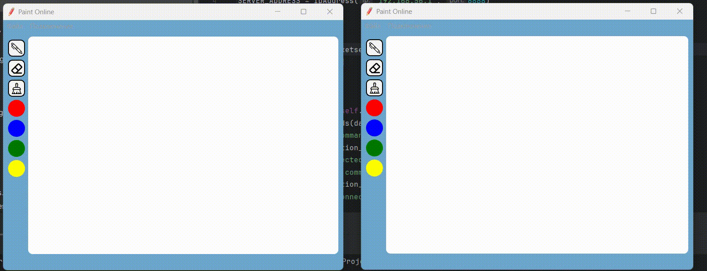

# PaintOnline

## Обзор
Этот проект реализует приложение, позволяющее нескольким пользователям рисовать в режиме реального времени на одной поверхности.

## Пример использования
- Для запуска приложения необходимо один раз на сервере запустить server.py. 
- Каждый клиент запускает у себя main.py. 
- После ввода ip:port сервера можно рисовать.

 

## Структура проекта на GitHub
1. `client`
   - `app`
     - `template`
       - ui и py файлы графического интерфейса
     - Файлы реализующие клиентскую часть приложения
   - Файл запуска клиента

2. `server`
   - Файл реализующий серверную часть
3. `utils`
   - Файл реализующий класс ip адреса
4. `img`
   - Все файлы изображений.

Клиент представлен 5 файлами:
- App.py — главный класс клиентской части приложения
- Client.py — класс для отправки данных на сервер
- ConnectDialog.py — класс диалогового окна подключения к серверу
- Listener.py — класс для получения данных с сервера в отдельном потоке
- Surface.py — класс-обработчик событий поверхности для рисования
Сервер состоит из 1 файла:
- Server.py — главный класс серверной части приложения

## Стек
Python, PyQt5, socketserver, threading, json, time